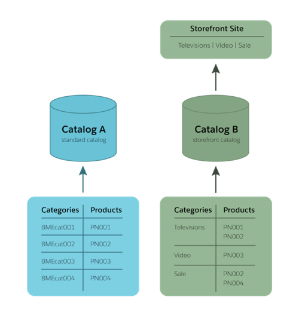

# Work With a B2C Site
[Return to Contents](README.md)

## Given a Business Manager task, work with the product data model to manage products and product search model, their categorization, and associated inventory and pricebooks.
- Catalogs
    - Contains products, categories, and images
    - Each storefront can have only a single catalog, but an organization can have multiple catalogs
    - **Standard** catalog
        - Products can be assigned to a **standard** catalog, with a structure that maps to an external inventory/fulfillment system
        - Not assigned to a specific store
    - **Storefront** catalog
        - Storefront catalogs determine storefront navigation based on their category structure
        - Assigned to a specific store

- Categories
    - Contains products
    - Defines catalog structure
- Products
    - Owned by one catalog, but can be included in multiple catalogs and categories
    - To display in a storefront, a product must be:
        - Assigned to a storefront category
        - Searchable
        - Online
        - Available

| Product Type | Definition
|-|-
| Standard | A single product with no variations
| Master | The product that "owns" all variations of a product
| Variation Group | A specific subset of variations, based on a single attribute (color, size)
| Variation | A specific selection of product options (Small + White, Small + Gray, Large + White, etc.)
| Set | A group of products that are displayed together, and **may** be bought together
| Bundle | A group of products that are displayed together, and **must** be bought together
| Option | Optional accessories/upgrades that can only be purchased alongside another product
- Inventory List
    - Represents the inventory of a site
    - Each site can be assigned only one inventory list, but one inventory list can be assigned to multiple sites
- Price Book
    - Contains price details for products
    - Can contain **price tables**, which can set  product prices based on the quantity currently being purchased (bulk discounts)
        - Only one active price table can be active per product
    - Price books are organization wide, and can be assigned to multiple sites
    - Price books must be assigned to a site before it can be used on the storefront
- Additional Resources
    - https://trailhead.salesforce.com/content/learn/modules/cc-digital-merchandising/digital-product-data

## Given a configuration for tasks, such as payment and shipping information, use Business Manager to complete storefront orders.
- Instructions for updating order information in Business Manager:
    - https://documentation.b2c.commercecloud.salesforce.com/DOC3/index.jsp?topic=%2Fcom.demandware.dochelp%2Fcontent%2Fb2c_commerce%2Ftopics%2Fordering%2Fb2c_update_orders.html

## Given a configuration task, use Business Manager to work with Content Assets, Page Designer, Content Slots, and Content Folders.
- [Manage Content Assets](https://documentation.b2c.commercecloud.salesforce.com/DOC1/index.jsp?topic=%2Fcom.demandware.dochelp%2Fcontent%2Fb2c_commerce%2Ftopics%2Fcontent%2Fb2c_working_with_content_assets.html)
- [Page Designer](https://documentation.b2c.commercecloud.salesforce.com/DOC1/index.jsp?topic=%2Fcom.demandware.dochelp%2Fcontent%2Fb2c_commerce%2Ftopics%2Fcontent%2Fb2c_content_assets.html)
    - [Page Designer Resources](https://developer.commercecloud.com/s/article/PageDesigner)
- [Content Slots](https://documentation.b2c.commercecloud.salesforce.com/DOC1/index.jsp?topic=%2Fcom.demandware.dochelp%2Fcontent%2Fb2c_commerce%2Ftopics%2Fcontent%2Fb2c_content_assets.html)
- [Content Folders](https://documentation.b2c.commercecloud.salesforce.com/DOC1/index.jsp?topic=%2Fcom.demandware.dochelp%2Fcontent%2Fb2c_commerce%2Ftopics%2Fpage_designer%2Fb2c_creating_pd_pages.html)
- Additional Resources
    - https://trailhead.salesforce.com/content/learn/modules/b2c-page-designer-merchandiser
    - https://trailhead.salesforce.com/content/learn/modules/cc-create-functional-consulting-documents/cc-doc-content-assets-and-slots
